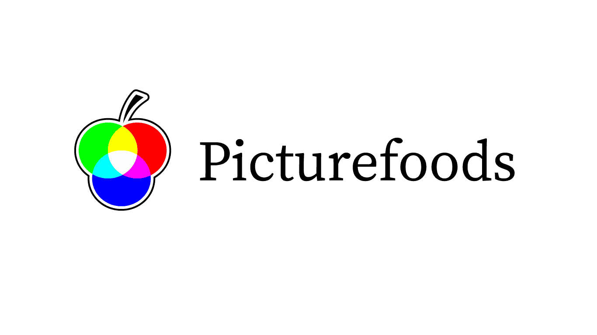

# PictureFoods
## «Snapshot Recipes»

([Logo](https://github.com/schafeld/picturefoods/blob/master/concept/artwork/logo/logo-picturefoods-002.png) font is Source Serif Variable (Roman))

Web app for food and beverage image recognition and corresponding recipe recommendation.

Please see LICENSE files for distribution and usage permissions/restrictions. 

In short: 
- Use the code ('code/') as you like.
- But do *not* use or copy the design ('concept/') without prior written consent from the copyright holder.
